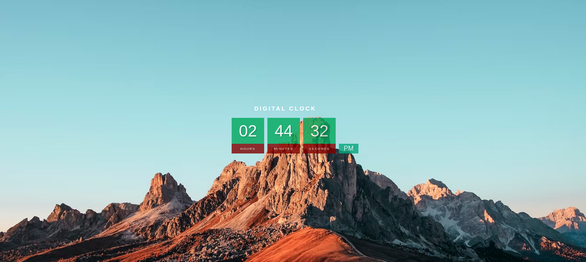

### Description:

https://izaand98.github.io/Digital-Clock-Web-App/

This is a digital clock web application built using HTML, CSS, and JavaScript. The clock shows the current time in hours, minutes, and seconds, as well as AM or PM. The background of the clock features a beautiful nature image obtained from Unsplash. The clock updates automatically every second.

To run this web application, you can simply open the HTML file in a web browser. The application is designed to work on all modern web browsers.

To use this code for your own project, you can clone or download this repository and customize the HTML, CSS, and JavaScript code to meet your specific needs.

The code is provided under the MIT license, which allows you to use, copy, modify, merge, publish, distribute, sublicense, and/or sell copies of the software, subject to certain conditions.

### Technologies used:

- HTML: for structuring the web page
- CSS: for styling the web page
- JavaScript: for adding interactivity to the web page and updating the clock in real-time.
